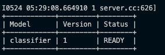

This repo contains a minimal example of running an [ONNX model](https://onnx.ai) served by [NVIDIA Triton Server](https://github.com/triton-inference-server/server) on a CPU-based setting.  More info about the folder structure and configurations for ONNX models can be found [here](https://docs.nvidia.com/deeplearning/triton-inference-server/user-guide/docs/user_guide/model_repository.html#onnx-models).

We provide a **randomly initialized** classifier in `onnx_model/` folder, and a Python script `intference_example.py` which illustrates how to make an HTTP request to the Triton server for inference.

# Quickstart

## Running the Model with Triton

Running the Triton server requires Docker to be installed. The Docker image we're using is a [CPU-based Triton server](https://hub.docker.com/layers/jackiexiao/tritonserver/22.06-onnx-py-cpu/images/sha256-b828f72e5317d95dc513d9ab06b7a0a13f9e5d604c5e33271911a152e8578700?context=explore).

Before running the docker image, ensure that you modify the volume mount path to the `onnx_model/` folder:

```yaml
    volumes:
      - <PATH_TO_model_onnx_FOLDER>:/models
```

To run the docker image, simply run

```console
docker compose up
```

If this is successful, you should see the following, which indicates that the model has been initialized correctly and ready for inference:



## Making HTTP Requests to Triton Server

To make an HTTP inference request to the Triton Server, you first need to install the requirements which include the [HTTP Triton Client package](https://github.com/triton-inference-server/client):

```console
pip install -r requirements.txt
```

And then to run the inference example:

```console
python inference_example.py
```

This should print out the logit outputs, for e.g.:

```console
Recieved logits: [[   36.51555  -377.1684    312.07822 -1028.188  ]]
```

# Support


If you encounter any problems, please do create a GitHub Issue